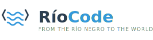

<div align="center">



# 🌊 RíoCode

### Code Flows, Solutions Grow

*High-quality software development from the heart of Patagonia*

[](https://en.wikipedia.org/wiki/Allen,_R%C3%ADo_Negro)
[](mailto:hello@riocode.dev)
[](#-tech-stack)

---

</div>

## 👋 About Us

We are a **full-stack development team** based in **Allen, Río Negro, Argentina**, specializing in creating robust and scalable digital solutions for businesses worldwide.

From one of Argentina's most productive valleys emerges **RíoCode**: where engineering precision meets software development creativity.

Our background in **bioengineering and technology** gives us a unique perspective—we approach every project with scientific rigor and innovative thinking.

## 💼 Our Services

- 🌐 **Web Applications** - React, Next.js, modern and responsive interfaces
- 📱 **Mobile Applications** - Cross-platform Flutter apps (iOS & Android)
- ⚙️ **APIs & Backend** - Node.js, Golang, scalable architectures
- 🔧 **Custom Solutions** - From MVPs to enterprise systems
- 🤝 **Technical Consulting** - Architecture design, code review, team training

## 🛠️ Tech Stack
```javascript
const riocode = {
  frontend: ['React', 'Next.js', 'Flutter', 'Tailwind CSS', 'TypeScript'],
  backend: ['Node.js', 'Express', 'NestJS', 'Golang', 'Gin'],
  mobile: ['Flutter', 'Dart'],
  databases: ['PostgreSQL', 'MongoDB', 'Firebase', 'Redis'],
  cloud: ['Vercel', 'Railway', 'Fly.io', 'AWS', 'Google Cloud'],
  tools: ['Git', 'Docker', 'GitHub Actions', 'Postman', 'Figma'],
  practices: ['Clean Code', 'TDD', 'CI/CD', 'Agile', 'Code Review']
}
```

## 🌍 Industries We Serve

- 🚀 **Tech Startups** - Fast MVPs and scalable platforms
- 🏭 **Industrial Companies** - Digital transformation solutions
- 🌾 **Agro-Tech** - Technology for the agricultural sector
- 🏥 **Health-Tech** - Bio-technology and healthcare applications
- 🛒 **E-commerce & Retail** - Online stores and marketplaces
- 📚 **Edu-Tech** - Educational platforms and learning management systems
- 💼 **B2B SaaS** - Business software and enterprise tools

## 📍 Our Philosophy

> "Like a river that flows constantly, our code evolves, adapts, and grows. We bring the dedication and quality of the Alto Valle region to every line of code we write."

### Our Principles

- ✅ **Clean & Maintainable Code** - We write code humans can read
- ✅ **Transparent Communication** - You'll always know the project status
- ✅ **On-Time Delivery** - We respect deadlines and your budget
- ✅ **Post-Delivery Support** - We're here even after launch
- ✅ **Collaborative Approach** - Your project, our expertise, shared success

## 🎯 Why Choose RíoCode?

| Aspect | What You Get |
|--------|--------------|
| 🧬 **Unique Background** | Engineering + biotech mindset = systematic problem-solving |
| 🌎 **Global Mindset, Local Roots** | International standards with personalized attention |
| 💰 **Competitive Pricing** | High-quality development at competitive rates |
| 🕐 **Flexible Timezone** | Argentina (GMT-3) works well with US and European clients |
| 🗣️ **Bilingual Team** | Fluent in Spanish and English |

## 📂 Featured Projects

*Coming soon - We're building amazing things!*

<!-- 
Template for future projects:
### 🎨 [Project Name](link)
Brief description of the project, technologies used, and impact.

**Tech:** React, Node.js, PostgreSQL | **Industry:** E-commerce
-->

## 🤝 How We Work

1. **Discovery** - We understand your vision and requirements
2. **Planning** - Detailed technical proposal and timeline
3. **Development** - Agile sprints with regular updates
4. **Testing** - Comprehensive QA and user acceptance testing
5. **Deployment** - Smooth launch with monitoring
6. **Support** - Ongoing maintenance and improvements

## 📫 Get In Touch

We'd love to hear about your project!

- 🌐 **Website:** [Building...]
- 📧 **Email:** [Building...]
- 💼 **LinkedIn:** [Building...]
- 📱 **WhatsApp:** [Building...]
- 🐦 **Twitter:** [Building...]
- 📸 **Instagram:** [Building...]
- 💻 **Workana:** [Building...]
- 🎯 **Upwork:** [Building...]

**Prefer a quick chat?** Feel free to open an issue in this repo or reach out directly through GitHub!

## 🌟 Client Testimonials

*Building our reputation, one satisfied client at a time. Your project could be our first success story!*

## 📊 GitHub Stats

<!--
Will be populated as we grow:
- Total projects delivered
- Lines of code written
- Happy clients
- Countries served
-->

*Statistics coming soon as we complete projects!*

## 🗺️ Our Location

Based in **Allen, Río Negro, Argentina** - in the heart of the **Alto Valle** region, known for:
- 🍎 High-quality fruit production (we bring the same quality to code)
- 🏔️ Patagonian resilience and work ethic
- 🌊 The Río Negro (Black River) that gives us our name
- 🌍 A growing tech hub in South America

---

<div align="center">

### 🇦🇷 Built in Argentina with ❤️ and ☕

**From the Río Negro to the World**

*Del Río Negro al Mundo*

---

**🌊 RíoCode** - Where Engineering Meets Innovation

[⭐ Star this repo](../../stargazers) if you like what we're building!

*Last updated: MArch 2026*

</div>
